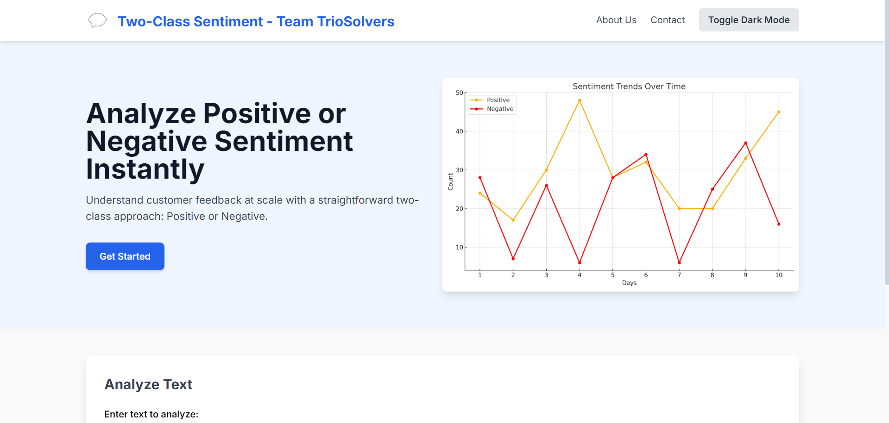
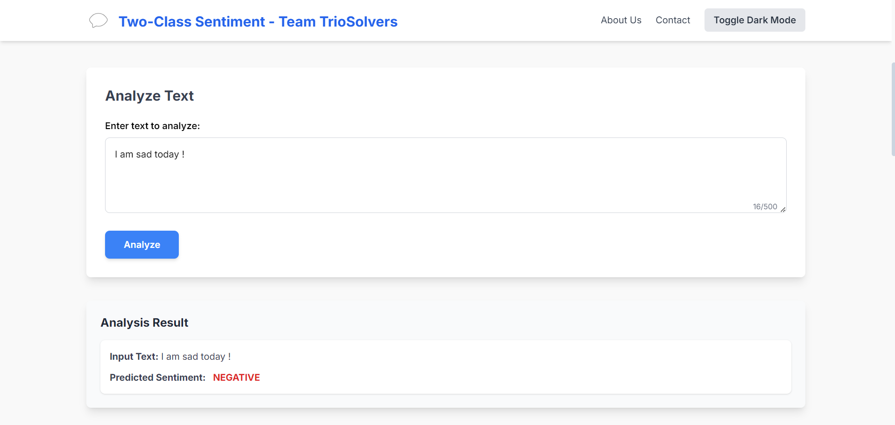
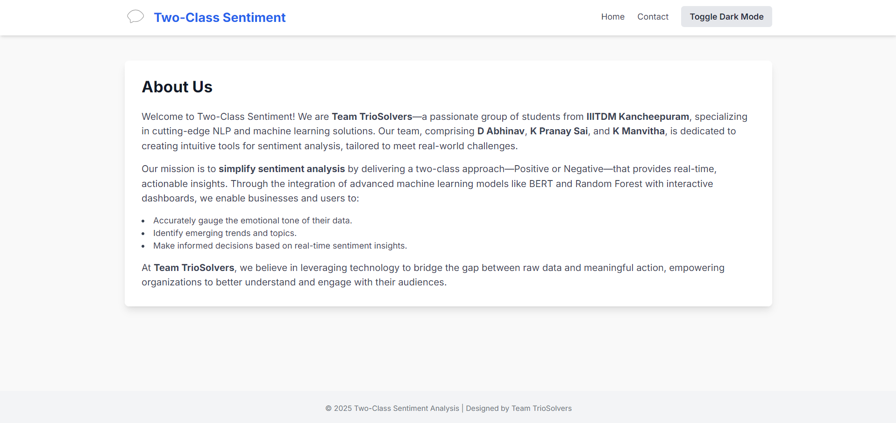
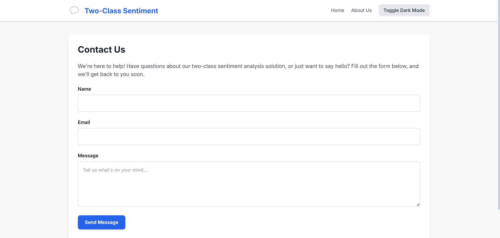

# Two-Class Sentiment Analysis


*Home Page of the Sentiment Analysis Application*


*Prediction Results and Insights Page*


*About Us*


*Contact Us*


---
## Overview
The **Two-Class Sentiment Analysis** project leverages state-of-the-art Natural Language Processing (NLP) techniques to classify text as **Positive** or **Negative** in real-time. The system integrates traditional Machine Learning (Random Forest) and modern Transformer-based models (BERT) to provide robust and actionable insights into sentiment trends.

## Features
- **Real-Time Sentiment Analysis**: Quickly processes text inputs to classify sentiments.
- **Hybrid Model Architecture**: Combines Random Forest and BERT for enhanced accuracy.
- **Trending Topic Detection**: Identifies frequently discussed topics from user inputs.
- **Dynamic Visualizations**: Generates real-time sentiment distribution graphs and word clouds.
- **User-Friendly Interface**: Interactive web app built with Flask and modern UI/UX principles.
- **Actionable Insights**: Highlights negative trends for business improvements.

## Team Members
- **D. Chaitanya Abhinav**
- **K. Pranay Sai**
- **K. Bala Sai Manvitha**

**Institution:** IIITDM Kancheepuram

---

## Table of Contents
1. [Introduction](#introduction)
2. [Dataset](#dataset)
3. [Methodology](#methodology)
4. [System Architecture](#system-architecture)
5. [Implementation](#implementation)
6. [Results](#results)
7. [How to Run](#how-to-run)
8. [Future Work](#future-work)
9. [References](#references)

---

## Introduction
Sentiment analysis, also known as **opinion mining**, helps businesses understand public perception by analyzing textual data. Our project simplifies this process into a **two-class approach**, enabling organizations to quickly identify positive or negative sentiments from customer feedback or social media data.

---

## Dataset
### Data Overview
- **Source**: Twitter API
- **Size**: 73,681 tweets labeled into:
  - Positive
  - Negative
  - Neutral
  - Irrelevant
- **Preprocessed for Binary Classification**: Reduced to **Positive** and **Negative** classes.

### Preprocessing Steps
1. **Cleaning**: Removed URLs, emojis, and special characters.
2. **Tokenization**: Split text into individual tokens.
3. **Stopword Removal**: Removed common but non-informative words (e.g., "and", "the").
4. **Lemmatization**: Reduced words to their base forms (e.g., "running" → "run").

---

## Methodology
### Model Selection
1. **Random Forest**:
   - Ensemble model trained on TF-IDF-transformed text.
   - Provides interpretability and robust performance.
2. **BERT**:
   - Pre-trained Transformer model (`distilbert-base-uncased` fine-tuned on SST-2).
   - Excels in contextual language understanding.

### Hybrid Ensemble
- **Decision Rule**:
  1. BERT prediction prioritized for its accuracy.
  2. Random Forest acts as a secondary layer for consistency.

---

## System Architecture
1. **Data Ingestion**: Accepts user text input via a web interface.
2. **Preprocessing**: Cleans and tokenizes the input text.
3. **Inference**:
   - Runs BERT and Random Forest models.
   - Combines predictions using a decision rule.
4. **Visualization**:
   - Sentiment distribution graphs.
   - Word clouds for trending topics.

---

## Implementation
### Backend
- **Framework**: Flask
- **Endpoints**:
  - `/`: Serves the homepage.
  - `/predict`: Processes user input and returns predictions.
- **Models**: 
  - Random Forest model (`random_forest_model.joblib`).
  - TF-IDF vectorizer and scaler (`tfidf_vectorizer.joblib`, `scaler.joblib`).
  - BERT sentiment classifier via Hugging Face.

### Frontend
- Built with **HTML**, **CSS**, and **TailwindCSS** for a modern design.
- Features include:
  - **Dark Mode Toggle**
  - **Dynamic Charts** using Matplotlib
  - **Real-Time Sentiment Graphs**

---

## Results
### Quantitative Evaluation
- **Random Forest Accuracy**: 90%
- **BERT Accuracy**: 95%
- **Hybrid Ensemble Accuracy**: 97%

### Visual Insights
1. **Trending Topics**:
   - High-frequency words identified from user inputs.
   - Helps businesses track real-time discussions.
2. **Sentiment Distribution**:
   - Real-time graph showing proportions of positive and negative sentiments.

---

## Steps to Run

1. **Clone the repository:**
   ```bash
   git clone https://github.com/Abhinavreddy1605/hackathon.git

2. **Navigate to the project directory:**
   ```bash
   cd hackathon
   
3. **Install required libraries using:**
    ```bash
    pip install -r requirements.txt

4. **Start the Flask server:**
   ```bash
   python app.py
   
5. **Access the application in your browser:**
   ```bash
   (http://127.0.0.1:5000/)

## Future Work

- **Multilingual Support**: Extend to non-English text using multilingual BERT models.
- **Time-Series Analysis**: Include temporal trends in sentiment data.
- **Demographic Insights**: Integrate user-specific metadata for advanced analytics.

---

## References

1. Vaswani, A., et al. (2017). *Attention Is All You Need*.
2. Breiman, L. (2001). *Random Forests*.
3. [Hugging Face Transformers Documentation](https://huggingface.co/docs).
4. [NLTK Documentation](https://www.nltk.org).


